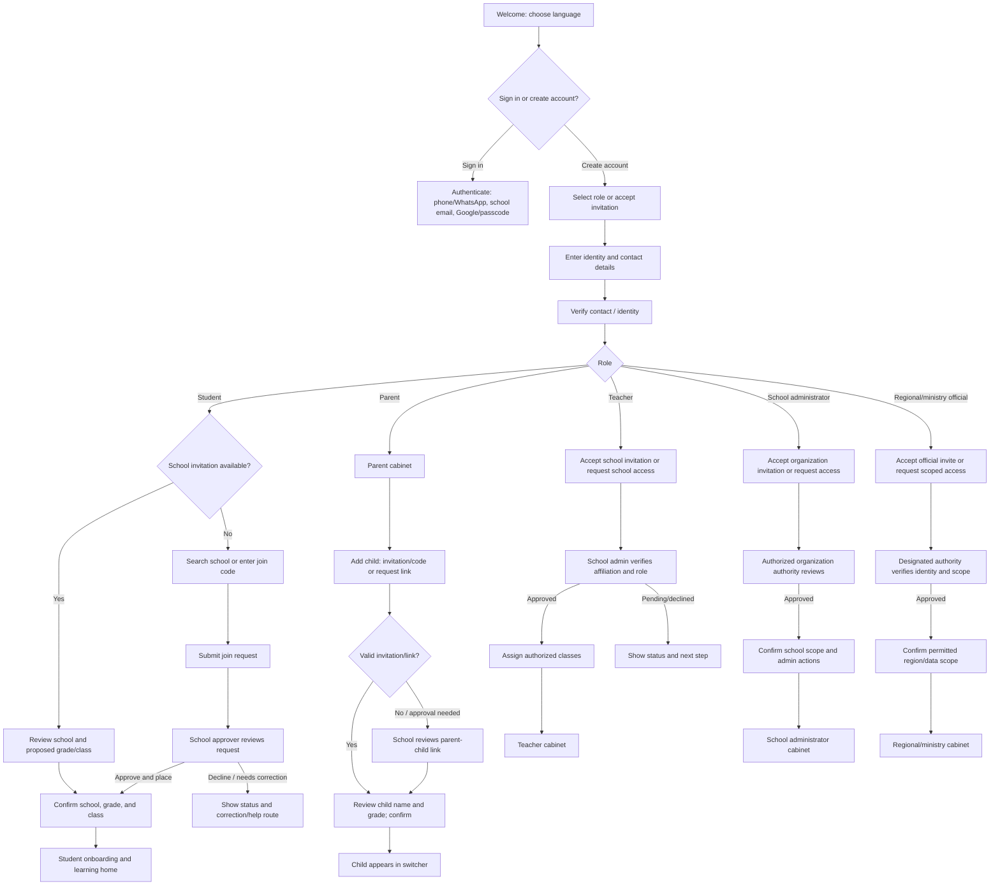
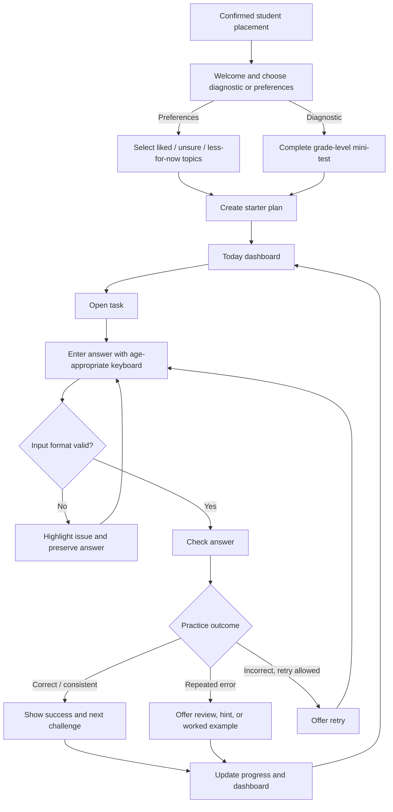
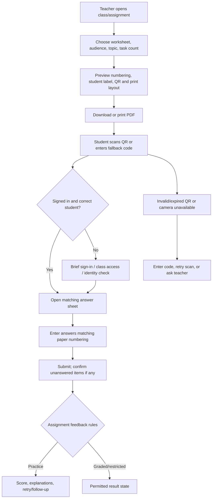
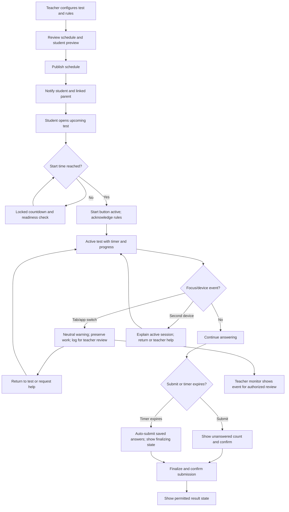
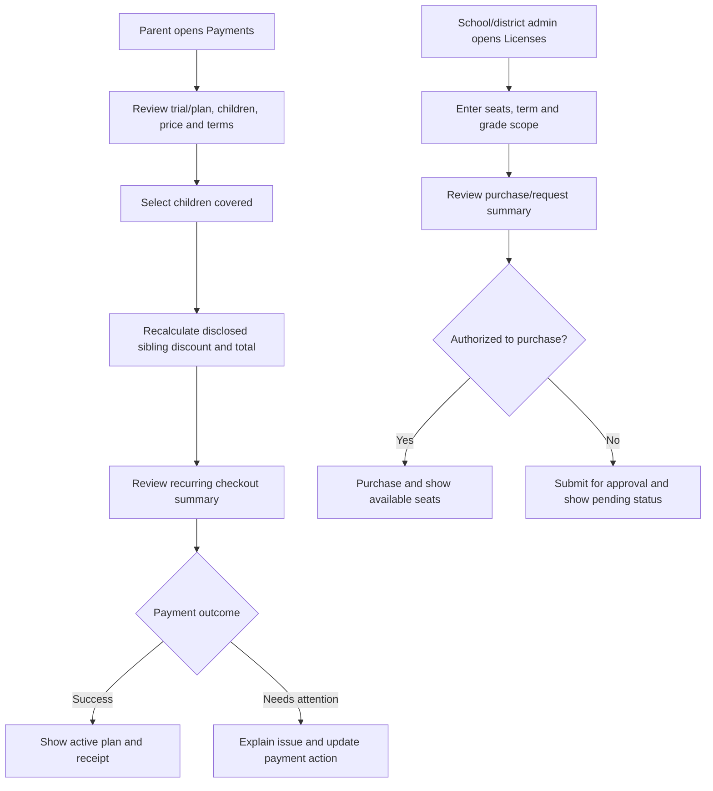
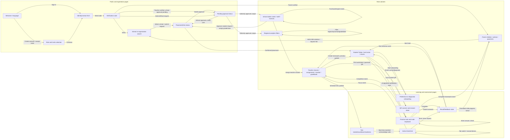

# Math Prep KZ — Functional UX and User-Flow Specification

**Document type:** Product-level functional and UX specification  
**Audience:** Product, UX, pedagogy, school operations, and policy stakeholders  
**Scope:** Visible screens, user actions, state changes, notifications, role interactions, and user journeys. This document intentionally excludes backend implementation details.

## Product context and policy assumptions

Math Prep KZ serves students in Grades 1–11, parents, teachers, school administrators, and regional or ministry education officials in Kazakhstan. The interface supports Kazakh, Russian, and English, with language changes preserving the current task and entered work.

The product must distinguish **identity**, **role**, and **organization placement** in its screens. A person may hold more than one role, such as parent and teacher, but must switch explicitly between role contexts. A student belongs to a school and class only after a school-authorized roster or enrollment action; entering a school name alone must not silently enroll the child. Exact legal identity requirements, consent language, school verification evidence, exam response thresholds, trial duration, and sibling discount rates require policy decisions before launch.

# 1. Phase 1: Multi-Analyst Debate & Edge-Case Q&A

*This is a structured design review among four specialist perspectives.*

## A. Grade 1 student enters a typo

**Lead UX/UI Designer:** Use large, high-contrast keys, one obvious backspace button, a visible answer preview, and short prompts. A child should be able to correct one digit without clearing the whole answer.

**Pedagogical & Adaptive UX Specialist:** Treat input-format errors separately from mathematical misconceptions. In practice, allow a retry and then a hint or explanation. Avoid revealing correctness during a diagnostic if that would distort the diagnostic.

**Proctoring & Assessment UX Specialist:** Test editing and retry rules must be disclosed before the test. The timer remains visible while a student edits.

**Lead Business Analyst:** Preserve the answer when validation fails and explain precisely what needs correction.

**Consensus:** Validate as the student types. For incomplete syntax, say “Finish your answer” and highlight the input. Practice may offer retries and explanations; timed assessments follow their disclosed settings.

## B. Printed QR to digital answer sheet without login friction

**Lead Business Analyst:** The QR can identify a worksheet or an individual assignment. A student-specific sheet must not be exposed before the student is identified.

**Lead UX/UI Designer:** Open a focused answer sheet, not the full dashboard. Make the active student/class visible when identity was checked.

**Pedagogical Specialist:** Match the printed task numbering and wording so the student can move between paper and screen naturally.

**Proctoring Specialist:** A worksheet QR must not bypass a scheduled test lock.

**Consensus:** A signed-in student goes straight to the matching answer sheet. Otherwise, use a brief sign-in or class access step before showing personal work. Keep scheduled assessments locked until their disclosed start conditions are met.

## C. Tab switch or second device during a timed exam

**Proctoring Specialist:** A focus change triggers a neutral warning and a teacher-visible review event. Repeated events follow a disclosed, teacher-configured response.

**UX/UI Designer:** Say what happened and how to return; do not accuse the student. Provide accessible recovery guidance for accidental switches.

**BA:** A second-device attempt should not silently erase work. Device-failure recovery needs a stated school policy.

**Pedagogical Specialist:** Show the rules before the test and offer a readiness check.

**Consensus:** Require acknowledgment of rules before start. Warn on focus loss, preserve progress where possible, and record events for authorized review. A second-device attempt presents return/help choices. Thresholds and consequences are school policy decisions.

## D. Teacher homework assignment and parent/student notices

**BA:** Delivery depends on the student’s confirmed parent links and notification preferences.

**UX/UI Designer:** Student sees the task and due date in their task list. Parent sees a concise child-specific summary.

**Pedagogical Specialist:** Reminders should support the student without turning each incomplete task into an alarm.

**Proctoring Specialist:** Clearly distinguish homework reminders from test alerts.

**Consensus:** Publishing places the task in the student cabinet and updates the linked parent activity feed. Notifications honor channel preferences. Completion updates both views; a grade appears only when the work is checked.

## E. Registration and placement: who says which school a child attends?

**BA:** Do not let a parent or student self-assign into a school roster using an unverified school name. Enrollment should originate from an authorized school roster/invitation or a school-reviewed request.

**UX/UI Designer:** Ask the student/parent for the school only as a search or request, then show the selected school and class for review. Avoid exposing student rosters during lookup.

**Pedagogical Specialist:** Grade and class placement should be confirmed by the school; a placement error can produce inappropriate daily tasks and reporting.

**Proctoring Specialist:** An exam or class assignment must not become visible until the identity and school/class context are confirmed.

**Consensus:** A school administrator or authorized teacher initiates roster enrollment, or a parent/student submits a join request that school staff approve. A child is not considered enrolled until confirmation. Parents link to an existing student record through an invitation code or school-approved verification. Students can report a wrong school/class and request correction.

# 2. Phase 2: Agreed UX Principles & State Transition Map

## Agreed UX principles

1. Make the next action obvious and offer help or return routes.
2. Tailor interaction density and language to age and role.
3. Keep practice, homework, and assessment rules visibly distinct.
4. Show identity and organization context before sensitive content or assessment entry.
5. Preserve work and explain validation, access, and submission failures.
6. Use calm, factual proctoring messages and authorized human review.
7. Scope every cabinet to the user’s verified role and organization.
8. Make notifications actionable and recipient-specific.
9. Support Kazakh, Russian, and English without losing progress.
10. Keep policy-dependent values configurable and explicit; do not invent rules in interface copy.

## High-level state transition map

| Journey | Main states | Trigger | Feedback and destination |
|---|---|---|---|
| Registration | Welcome → account details → verify identity → choose role(s) → join/create organization → review → pending/active | User submits details or accepts invitation | Show confirmation, pending review, or role cabinet |
| Student placement | Unplaced → school found/invited → class/grade selected by authorized staff → parent link → active | School approves roster/join request | Student sees confirmed school/class and correct grade home |
| Parent linking | Parent home → add child → verify invitation/request → review child identity → confirm | Code valid or school approves request | Child appears in switcher; otherwise request status is visible |
| Teacher placement | Teacher registration → school invitation/request → school admin verifies → class access | School admin approves | Teacher sees only authorized classes |
| Learning | Onboarding → diagnostic/preferences → plan → task → feedback → progress | Student completes items | Dashboard and next tasks update |
| QR worksheet | Scan → identity/access check → answer sheet → submit → result | Valid scan and submission | Score/explanation or permitted feedback state |
| Timed test | Locked → ready → active → warning/recovery as needed → submitted/expired | Time opens, student starts, submits, or timer expires | Student and teacher see final attempt state |
| Subscription | Trial/plan view → checkout → active/attention | Trial ends, purchase, or payment issue | Show coverage, renewal and next action |

# 3. Phase 3: Comprehensive User Flow & Micro-UX Specification

## 3.1 Registration, Auth, Identity & Role Linkage Flows

### 3.1.1 Registration model and responsibility

Registration is a guided process with two related but separate outcomes:

- **Account creation:** Establishes a person’s sign-in and preferred language.
- **Role and placement activation:** Establishes what the person may do and which school, class, child, or region they may access.

The flow should support invitations and self-start. A user may begin registration independently, but role access requiring school or government authority remains pending until an authorized person confirms it.

| Role | Who starts registration | Who verifies/assigns access | Required placement outcome |
|---|---|---|---|
| Student | School staff, parent invitation, or student/parent join request | School administrator or authorized teacher; parent link separately confirmed | School, grade, and class confirmed before school work appears |
| Parent | Parent self-registers or follows a student invitation | Identity/contact verification; school approves child-link request if no valid invitation | One or more confirmed child links; no school cabinet access |
| Teacher | Teacher self-registers or accepts school invitation | School administrator or designated school approver | School membership and explicitly assigned classes |
| School administrator | Accepts organization invitation or requests school-admin access | Existing authorized administrator or designated organization authority | School-level scope confirmed |
| Regional/ministry official | Accepts official invitation or requests access | Designated regional/ministry authority | Explicit geographic/organization scope confirmed |

### 3.1.2 Universal account registration entry

1. **Page opened:** Public welcome page.
2. **Visual elements shown:** Language picker (Қазақша / Русский / English); “Sign in”; “Create account”; role summaries; “I have an invitation”; accessible help link.
3. **User action:** Chooses “Create account,” follows an invitation, or signs in.
4. **System feedback/state event:** Registration explains that account creation and school/role approval may be separate. User selects intended role(s), with plain-language descriptions.
5. **Next screen/notification:** Role-appropriate sign-in method and identity details. If an invite was followed, display the inviting school/organization and role for confirmation before acceptance.

**Controls:** Allow multiple roles on one person account (for example Parent + Teacher) where policy permits. After authentication, role switch is explicit and visually labeled. Never merge accounts based only on matching names.

### 3.1.3 Student registration and school/class assignment

#### Path A — school or teacher invitation (preferred)

1. **Page opened:** Invitation landing screen from a school-provided link/code or QR.
2. **Visual elements shown:** School name, intended grade/class if known, inviter role, invitation expiry/help, “Accept invitation.” Do not show classmates’ identities.
3. **User action:** Student or parent accepts; student signs in or creates account using the available age-appropriate identity route.
4. **System feedback/state event:** Show the student’s name/grade details for confirmation by the responsible adult where required. If the invitation contains a class placement, label it “Proposed placement” until confirmed by the authorized school role.
5. **Next screen/notification:** If verified, student sees the confirmed school/class and proceeds to learning onboarding. If approval is needed, show “Waiting for school confirmation,” who can resolve it, and a request reference.

#### Path B — student or parent requests to join a school

1. **Page opened:** “Join a school” during onboarding or parent cabinet.
2. **Visual elements shown:** School search by name/city or school-provided join code; instructions not to choose a school unless the child attends it; “Request access.”
3. **User action:** Searches/selects school and submits a request with the minimum identity information required by school policy.
4. **System feedback/state event:** Confirm the school name and request status. If multiple schools match, include city/address cues for disambiguation. Do not expose student lists.
5. **Next screen/notification:** Request goes to an authorized school approver. Parent/student sees pending status. Upon approval, school staff assign or confirm grade/class and the user receives an in-app notification. On decline, show a reason if provided and “Try another school” or “Contact school.”

#### Authorized school placement

1. **Page opened:** School administrator/authorized teacher → roster or join requests.
2. **Visual elements shown:** Pending requests, student identity fields permitted by policy, school, proposed grade/class, “Approve,” “Edit placement,” “Decline,” and a confirmation preview.
3. **User action:** Confirms identity and selects the actual grade/class; approves or requests correction.
4. **System feedback/state event:** Before approval, show impact: student will see class tasks and the correct grade-level learning home. For a move, show old and new class plus effective date.
5. **Next screen/notification:** Student and linked parent receive placement confirmation. Teacher sees the student in the approved class. If declined, user receives a clear next step.

**Placement rules visible in UX:** The school confirms grade and class; parent/student may request a correction but cannot silently override the roster. A student transferring schools follows a new join/approval and an explicit old-placement transition. The interface must identify the active school when the student has multiple valid affiliations.

### 3.1.4 Parent account and child linking

1. **Page opened:** Parent registration/sign-in → “Add a child.”
2. **Visual elements shown:** “Use school invitation” (recommended), “Enter join code,” or “Request link from school”; IIN option only if the approved policy supports it; privacy explanation.
3. **User action:** Uses a code or requests a link. Parent confirms the child’s displayed name and grade when a valid match is found.
4. **System feedback/state event:** Link becomes active only after required verification. Existing or mismatched links show a safe error without exposing another student’s records.
5. **Next screen/notification:** Child appears in a multi-child switcher. Parent can repeat for more children. If school approval is needed, show pending state and notify the parent when resolved.

**Required recovery:** “I can’t find my child,” “Wrong child shown,” “Code expired,” and “I’m already linked” actions. Unlinking requires a clear confirmation and explanation of what the parent will stop seeing.

### 3.1.5 Teacher registration and school/class assignment

1. **Page opened:** Teacher registration or invitation landing page.
2. **Visual elements shown:** School email sign-up/sign-in, invitation acceptance, school search/request, role explanation, “Continue.”
3. **User action:** Creates/signs into account and accepts a school invite, or submits a request to join a school.
4. **System feedback/state event:** Shows the school and requested role before submission. Teacher access stays pending until an authorized school administrator confirms employment/affiliation.
5. **Next screen/notification:** On approval, teacher enters the cabinet with assigned classes only. If no classes are assigned, show an empty state with “Ask an administrator to assign classes” and (if authorized) “Create class.”

**Class creation flow:** Teacher opens “Create class,” enters display name and grade, reviews school context, and submits. If school policy requires approval, class remains pending. Teacher adds students via school roster or invitations, then reviews the roster before confirming. A student invitation does not imply school enrollment until accepted and placement verified.

### 3.1.6 School administrator registration and organization assignment

1. **Page opened:** Organization invitation or “Request school administrator access.”
2. **Visual elements shown:** School identity, intended authority level, inviter/approver, organization search if no invite, and “Accept” or “Request access.”
3. **User action:** Accepts the invitation or submits an access request with school-identifying details.
4. **System feedback/state event:** Summarizes school scope and actions the role will enable (rosters, classes, staff, licenses, school analytics). Requires confirmation before activation.
5. **Next screen/notification:** Authorized organization authority approves or declines. When approved, show school cabinet onboarding checklist: confirm school profile, invite/verify staff, review roster, set class organization, and review seats. Until approval, only request status is visible.

### 3.1.7 Regional/ministry official registration and scope assignment

1. **Page opened:** Official invitation or request-access page.
2. **Visual elements shown:** Government/region organization, intended role, requested geographic scope, sponsor/approver, data access summary.
3. **User action:** Accepts invite or requests access and selects the smallest necessary region/scope.
4. **System feedback/state event:** Shows exactly which aggregate dashboards and drill-down levels the role will receive. Student-level data access, if ever permitted, requires a separate explicit grant and policy notice.
5. **Next screen/notification:** Designated authority approves, scopes, or declines. On approval, official sees filtered regional cabinet. Scope changes are confirmed and announced visibly.

### 3.1.8 Authentication methods, verification, and account recovery

- **Student:** IIN or phone with WhatsApp one-time code, where enabled by policy and age/guardian requirements.
- **Teacher:** School email and password; invitation acceptance may prefill school context.
- **Parent:** Google sign-in or phone/passcode route; child linking remains a separate verified step.
- **All roles:** Display code expiry/resend timing, preserve typed identity on retry, and provide accessible recovery. Never reveal whether an unrelated account exists through a public error message.
- **Role switching:** Account menu → “Switch role” → role cabinet. Confirm organization context if the same role spans more than one school.
- **Account recovery:** “Forgot access?” → select a verified contact method → confirm code → set new credential/passcode → show active sessions or role context as policy permits.

### 3.1.9 Registration status states

| Status | User sees | Available action |
|---|---|---|
| Identity not verified | “Verify your contact to continue” | Resend code, edit contact, help |
| School join pending | School name, submitted date, “Waiting for school” | Cancel request, correct details, contact school |
| Role pending | Requested role and approver where known | View status, withdraw request |
| Active but unplaced | Account ready; no school/class yet | Join a school or accept invitation |
| Active and placed | School, grade/class, role badge | Open cabinet, report incorrect placement |
| Declined/expired | Plain-language reason/status | Request again, use new invite, contact approver |

## 3.2 Adaptive Diagnostic & Daily Practice UX

### Cold-start choice

1. **Page opened:** Student first-run welcome after account and school placement are active.
2. **Visual elements shown:** “Tell us what you like” and “Take a short level check” cards, estimated duration, and “You can change preferences later.”
3. **User action:** Selects a path.
4. **System feedback/state event:** Preference path presents age-appropriate topic choices; diagnostic presents grade-appropriate questions and progress.
5. **Next screen/notification:** Starter plan and “Start today’s practice.”

### Preference survey

1. **Page opened:** Topic preferences.
2. **Visual elements shown:** Topic tiles, “I like this,” “Not sure,” and “Less of this for now.”
3. **User action:** Selects preferences and “Done.”
4. **System feedback/state event:** Confirms preferences and explains that they affect variety, while learning goals still guide practice.
5. **Next screen/notification:** Starter plan and daily dashboard.

### Diagnostic mini-test

1. **Page opened:** Diagnostic instructions.
2. **Visual elements shown:** Approximate duration, permitted input examples, “Begin.”
3. **User action:** Answers each item.
4. **System feedback/state event:** Shows progress and input-format guidance without revealing correctness mid-diagnostic.
5. **Next screen/notification:** Summary of starting strengths and suggested practice areas; daily dashboard.

### Daily task loop and adaptive feedback

1. **Page opened:** Student “Today” dashboard.
2. **Visual elements shown:** Daily goal, task cards, streak, topic progress map, homework, upcoming tests, and “Continue.”
3. **User action:** Opens a task and answers.
4. **System feedback/state event:** Provides grade-appropriate input, hints, and format checks. Consistent success may lead to a modest challenge; repeated errors may prompt review and a worked example.
5. **Next screen/notification:** Result state offers next task, retry, hint, or explanation according to task settings. Dashboard progress updates.

Do not frame an adaptive review task as punishment. Provide “Why am I seeing this?” and avoid treating one error as a definitive weakness.

## 3.3 Hybrid Paper-to-Digital (QR Scan) Experience

### Teacher print workflow

1. **Page opened:** Teacher class → “Create worksheet” or assignment → “Print.”
2. **Visual elements shown:** Class/student selector, topic, task count, paper preview, QR personalization choice, “Download PDF,” “Print.”
3. **User action:** Selects audience, previews, downloads/prints.
4. **System feedback/state event:** Confirms whether each QR opens an individual answer sheet or shared task set.
5. **Next screen/notification:** Printable file and assignment details.

Preview verifies student/class label, QR visibility, task numbering, page breaks, and legibility. Include a short scan instruction and fallback code.

### Student scan and answer entry

1. **Page opened:** Camera scanner or platform PWA scanner.
2. **Visual elements shown:** Camera permission prompt, scan frame, and “Enter code instead.”
3. **User action:** Scans QR.
4. **System feedback/state event:** Confirms worksheet found. If identity is missing, requests brief sign-in/class access before showing personal work.
5. **Next screen/notification:** Dedicated answer sheet matching paper numbering and wording.

### Submission

1. **Page opened:** Worksheet answer sheet.
2. **Visual elements shown:** Worksheet title, student/class context, numbered answers, progress, math keyboard, save state, “Submit.”
3. **User action:** Enters and submits responses.
4. **System feedback/state event:** Checks against assignment settings and confirms if unanswered items remain.
5. **Next screen/notification:** Score breakdown, per-question status, and explanations when allowed. Practice may offer retry/follow-up; graded work follows teacher feedback settings.

Invalid QR, expired worksheet, wrong student, and camera unavailable each get an explanation and a fallback such as code entry or teacher help. QR access never overrides a scheduled test lock.

## 3.4 Timed Test & Anti-Cheating UX Workflow

### Teacher schedule

1. **Page opened:** Teacher cabinet → class → “Schedule test.”
2. **Visual elements shown:** Class, test, date, start/end, duration, late-entry policy, focus rules, feedback visibility, student preview.
3. **User action:** Configures and taps “Review.”
4. **System feedback/state event:** Shows a summary with time zone and highlights conflicts or missing fields.
5. **Next screen/notification:** Teacher confirms “Schedule”; students and linked parents are notified according to preferences.

### Locked, readiness, active, and submit states

- **Before start:** “Test locked,” countdown, rules, and “Check readiness.” “Start test” is disabled with an explanation until available.
- **At start:** “Start test” activates. Student acknowledges exam rules and begins.
- **During:** Question, answer area, progress, remaining time, permitted tools, and “Submit.” A focus change triggers neutral warning, return action, and a teacher review event.
- **Second device:** Explain test is active elsewhere; offer return to active session or teacher help. Do not silently discard work.
- **Manual submit:** Show unanswered count, confirm, then display submitted state and permitted result.
- **Timer expires:** Show finalizing status, submit saved answers where possible, and confirm success or recovery steps.

Exact warning thresholds, automatic lock rules, late entry, and outage recovery are school policy decisions and must be visible before start.

## 3.5 Age-Adaptive Math Keyboards & Validation UX

### Grades 1–4

- Large, high-contrast keys; only task-permitted digits and basic operators.
- Backspace and confirmed “clear answer”; avoid unexpected system keyboard when structured input is expected.
- Optional spoken prompts; short text and encouraging visual feedback.
- Incomplete/invalid entry highlights the field and gives a concrete prompt such as “Add a number after +.”

### Grades 5–11

- Structured math keyboard for fractions, roots, brackets, exponents, variables, and relevant symbols.
- Formatted expression preview; undo, cursor movement, screen-reader labels.
- Separate syntax messages (“Check your brackets”) from correctness messages (“This answer does not match”).

### Shared input states

| State | Feedback |
|---|---|
| Empty | Example placeholder and focused input |
| Incomplete | Specific instruction to finish expression |
| Invalid format | Highlight and expected form |
| Ready | Enable “Check” or “Submit” |
| Correct | Success and next action |
| Incorrect practice | Retry, hint, or explanation as configured |
| Incorrect test | Follow disclosed test rules; do not reveal answers prematurely |

## 3.6 Role-Based Cabinets & Interactive Analytics Dashboards

### Student cabinet

- **Home:** Today’s tasks, streak, deadlines, “Continue.”
- **Task locker:** Practice, homework, tests by new/in-progress/completed.
- **Topic map:** Strength/review indicators by topic; tap for recent work and suggested tasks.
- **Results:** Past work with score/date and permitted explanations.
- Opening a card leads to details; “Start” or “Resume” restores its state.

### Parent cabinet

- **Child switcher:** Persistent selector with child name and grade.
- **Activity feed:** Assignments, completions, tests, and subscription notices.
- **Progress:** Topic summaries and plain-language practice areas.
- **Payments:** Plan, trial/renewal date, covered children, receipts, “Manage subscription.”
- Switching children updates all child-specific views. Confirmed links only.

### Teacher cabinet

- **Class list:** Create/open class; add students through school-approved route.
- **Homework assigner:** Topic, grade, due date, class, randomized unique values per student, preview, publish.
- **Live test monitor:** Not started/in progress/submitted/needs attention; select a student for authorized attempt details.
- **Gradebook:** Student/assignment grid with filters and distinct ungraded/missing states.
- Publishing updates student task lists and parent notices by preference.

### School administrator cabinet

- School-level participation, class activity, assessment completion.
- Filters by grade, class, topic, date; drill into permitted records.
- Roster, staff access, organization settings, and license seats within authority.

### Regional/ministry cabinet

- Aggregate participation, completion, and progress trends for permitted scope.
- Filters from region to city/district, school, grade, topic, date.
- Drill-down respects role scope and privacy; reports label scope and period.
- Default to aggregated data; student-level access requires explicit authority.

## 3.7 Subscription, Checkout & Multi-Child Discount UX

### Parent subscription

1. **Page opened:** Parent cabinet → Payments.
2. **Visual elements shown:** Trial status/end date, plan price, covered children, included features, renewal terms, “Choose plan.”
3. **User action:** Selects plan.
4. **System feedback/state event:** Checkout summary shows recurring amount, coverage, and renewal date before payment.
5. **Next screen/notification:** Success shows active plan and receipt. Failure explains payment update and any access timing.

The stated target is **500 KZT/month/student**. Trial duration, billing-day rules, fees/taxes, cancellation, and access after failed payment must be decided before final copy.

### Multi-child discount

1. **Page opened:** Plan selection.
2. **Visual elements shown:** Linked-child selector, base price, applicable discount per child, total monthly amount, renewal terms.
3. **User action:** Adds/removes children from covered subscription.
4. **System feedback/state event:** Recalculates immediately and identifies each child’s price.
5. **Next screen/notification:** Parent confirms coverage and checks out.

The discount percentage and eligibility rule are unspecified. Do not invent a rate or claim savings until policy is defined.

### School/district bulk licenses

1. **Page opened:** Administrator cabinet → Licenses → “Request seats” or “Purchase seats.”
2. **Visual elements shown:** Organization, seat quantity, term, grade eligibility, quote/price status, approval steps.
3. **User action:** Submits request or authorized purchase.
4. **System feedback/state event:** Review summary and “Pending approval” or “Ready to activate.”
5. **Next screen/notification:** Confirmation and seat availability; administrator sees remaining seats and assignment status.

## 3.8 Role Interaction and Notification Rules

| Event | Student sees | Parent sees | Teacher/admin sees |
|---|---|---|---|
| Student join request | Pending school approval | Pending child placement/link if parent initiated | Authorized approver sees request |
| Placement approved | School, grade, class confirmation | Child activity becomes available | Student appears in class roster |
| Homework published | Task, due date, start/resume action | Child-specific summary per preferences | Published status and assignment view |
| Homework completed | Result/next step | Activity feed update | Gradebook status updates |
| Test scheduled | Date/time/duration and test details | Child schedule summary | Schedule and monitoring view |
| Test event flagged | Neutral warning and return path | No proctoring alert by default unless policy requires | Authorized teacher sees event for review |
| Subscription needs attention | No payment details | Parent sees payment action and coverage state | School admin sees license state only if applicable |

Every notification should name the child/student, event, due time where relevant, and a direct destination. Respect channel preferences and prevent duplicate noisy alerts.

# 4. Mermaid User-Flow Diagrams

## 4.1 Registration and organization placement — all roles

## 4.2 Student learning and adaptive practice

## 4.3 Paper-to-digital QR workflow

## 4.4 Scheduled test, focus event, and submission

## 4.5 Parent subscription and bulk license flows

# 5. Mermaid Page, Interaction, Action & Event Map

This map focuses on screens and the user-visible action/event chain across roles.

## Appendix: Decisions required before final product copy or policy lock

- Which identity fields and guardian consent steps are mandatory by role and age?
- Which school proof or approver role confirms student/teacher/administrator affiliation?
- Can students belong to multiple schools/classes at once, and how is the active one selected?
- Who can move a student between classes and how is transfer history communicated?
- What are exam focus-loss thresholds, secondary-device behavior, late-entry rules, and outage recovery?
- How long is the parent trial, what are billing/cancellation rules, and when does access change after payment failure?
- What sibling discount percentage and eligibility rule apply?
- What student-level data, if any, may regional/ministry officials access?

These choices affect user-visible behavior and should be confirmed by product, school operations, and applicable policy owners before release.
