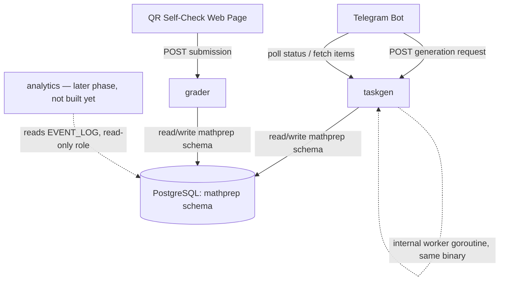
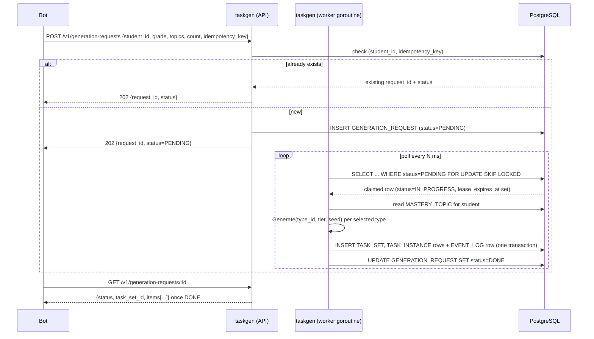
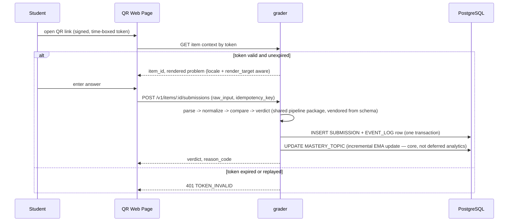

# 03 — Architecture

Supersedes the prior pass's single-`app-api` diagrams. Reflects ADR-006 (independent services) and the audit findings A, B, E, G from this pass's callout.

## Context diagram


Asserts: three independently deployable Go binaries (`taskgen`, `grader`, and later `analytics`), one shared Postgres schema owned by `schema`'s migrations, zero direct service-to-service network calls — all coordination is through the database (CON-04, CON-09, CON-10). Does not cover: authentication of the bot's own webhook (see `backend-integration.md` §5), or the CAS evaluator (no consumer yet, `OPEN-06`).

`taskgen`'s "worker" is not a fourth service — it is a goroutine inside the same binary, run in the same process as its HTTP handler (CON-06: keep this simple at family scale). This satisfies "separate independent services" (the operator's unit of separation was taskgen vs. grader vs. analytics, not handler-vs-worker within one service) — flagged as `[ASSUMPTION: ASM-11]` since the operator did not spell out whether handler and worker must themselves be separate deployables; the cheaper interpretation is adopted, reversible later at low cost (it is already structured as two goroutines communicating only through the DB, so splitting them into two binaries later is a small change).

## Sequence — generation via job queue (FR-007)


Asserts: idempotency checked before any row is written (FR-007); the lease/heartbeat pattern (`lease_expires_at`) prevents a crashed worker from permanently stranding a request in `IN_PROGRESS` — a second worker instance may reclaim it once the lease expires. Does not cover: the exact topic-weighting algorithm for FR-001 (still an open elaboration point, unchanged from the prior pass's note).

## Sequence — answer submission via QR (unchanged pattern, new owning service)


Asserts: `grader` never calls `taskgen` over the network — it reads `TASK_INSTANCE`'s frozen `correct_answer_json` directly from the shared schema. `MASTERY_TOPIC` update happens here, synchronously, because FR-001 needs it — this is the audit-flagged distinction (finding on log-journal phasing) made concrete in the diagram itself, not just in prose.

## State machine — TaskInstance lifecycle
Unchanged from the prior pass (`ISSUED → ANSWERED → FINALIZED / INVALIDATED → REGRADED → FINALIZED`, `ISSUED → EXPIRED`). `EXPIRED` threshold remains a config value, default 30 days, not hardcoded (see `08-developer-backlog.md` Phase 0).

## ERD — revised (findings A, B, E, G applied)

```mermaid
erDiagram
    USERS ||--o| STUDENTS : "is-a (user_type=STUDENT)"
    STUDENTS ||--o{ GENERATION_REQUEST : requests
    STUDENTS ||--o{ TASK_SET : receives
    TASK_SET ||--o{ TASK_INSTANCE : contains
    TASK_TYPE ||--o{ TASK_INSTANCE : generates
    TASK_INSTANCE ||--o{ SUBMISSION : receives
    STUDENTS ||--o{ SUBMISSION : makes
    STUDENTS ||--o{ MASTERY_TOPIC : has
    GENERATION_REQUEST ||--o| TASK_SET : produces

    USERS {
        uuid user_id PK
        string user_type "dictionary: STUDENT, GUARDIAN, ADMIN"
    }
    STUDENTS {
        uuid user_id PK_FK
        int grade
    }
    GENERATION_REQUEST {
        uuid request_id PK
        uuid student_id FK
        int grade
        jsonb topics
        int count
        string status "dictionary: PENDING, IN_PROGRESS, DONE, FAILED"
        string idempotency_key
        timestamp lease_expires_at
        timestamp created_at
    }
    TASK_TYPE {
        string type_id PK
        string domain "dictionary"
        string grade "dictionary: 1,2,3,4,5,6,7,8,9,10,11,UNIVERSITY"
        string spec_version
        string generation_mode "dictionary: CODE, HYBRID-AI"
        string status "dictionary: DRAFT, GATED, FINAL"
        string equivalence_policy "dictionary — no default, set explicitly per row"
        string validation_method "dictionary"
    }
    TASK_SET {
        uuid task_set_id PK
        uuid student_id FK
        uuid request_id FK
        timestamp issued_at
        string idempotency_key
    }
    TASK_INSTANCE {
        uuid item_id PK
        string type_id FK
        string spec_version
        string tier "dictionary: T1, T2, T3"
        string locale "dictionary — finding B"
        string render_target "dictionary — finding A"
        bigint seed
        jsonb params_json
        text problem_text
        jsonb correct_answer_json
        uuid task_set_id FK
    }
    SUBMISSION {
        uuid submission_id PK
        uuid item_id FK
        uuid student_id FK
        text raw_input
        string verdict "dictionary"
        string reason_code "dictionary"
        int attempt_index
        timestamp submitted_at
        string idempotency_key
    }
    MASTERY_TOPIC {
        uuid student_id FK
        string domain "dictionary"
        string tier "dictionary"
        float ema_score
        timestamp updated_at
    }
    EVENT_LOG {
        uuid event_id PK
        string event_type
        timestamp occurred_at
        jsonb payload_json
    }
```

**Idempotency constraints (finding D), now explicit, not prose:**
`UNIQUE(student_id, idempotency_key)` on `GENERATION_REQUEST`; `UNIQUE(student_id, idempotency_key)` on `TASK_SET`; `UNIQUE(item_id, student_id, idempotency_key)` on `SUBMISSION`.

**`MASTERY_TOPIC` grade dimension — finding G, left open, not decided here:** the table as drawn tracks `(student_id, domain, tier)` only. Whether mastery resets, decays, or carries forward across a grade transition is undecided. `[OPEN-08]`, owner: methodologist, no default assigned — this is a pedagogical judgment call, not a technical one, and guessing at it risks silently encoding a wrong model of how learning should be tracked across years.

**`EVENT_LOG` role:** append-only by database privilege (FR-008), not by application-level convention alone — the developer backlog specifies a Postgres role with `INSERT`-only grant on this table.

Interface contracts, endpoints, and error codes: specified once in `backend-integration.md` §5, referenced here.
